# 1. 表达式树基础

在本章中，将会讲解表达式树的基础知识，快速入门表达式树。


### 表达式树的概念

- 表达式树的创建有 **Lambda法** 和 **组装法**。
- 学习表达式树需要 **委托、Lambda、Func<>** 基础。
- 表达式树 形状可以参考 二叉树。

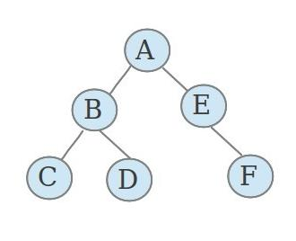

- 可以把表达式树理解成 数学表达式。

　　　　数学表达式的所有常量、符号为表达式树的底节点。每一次计算生成的结果是一个结点，或者说他们的共同结点就是他们应该进行的运算。

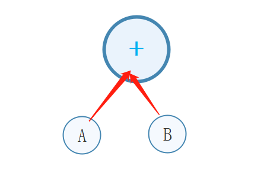

------

## 生成表达式树

表达式树的创建有 **Lambda表达式法** 和 **组装法**

为了方便，这里指定生成的表达式为 **( i \* j ) + ( x \* y )**

他们的运算是这样的：

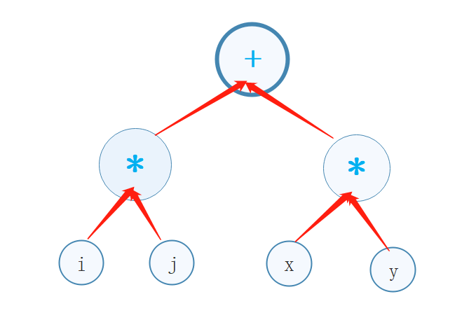

### Lambda 生成表达式树

 在控制台创建应用，需要引入 

```csharp
using System.Linq.Expressions;
```

　　1，创建表达式

　　　　(系统自动把 Lambda表达式 转为表达式树，当然，不是所有的 Lambda表达式都能转为表达式树，详细请参考文章后面的“系统自动把 Lambda表达式 转为 表达式树” 一节)

```csharp
 Expression<Func<int, int, int, int, int>> func = (i, j, x, y) => (i * j) + (x * y);
```

　　2，输出系统转换的表达式

　　　　输入这一行代码后运行，看看控制台输出的表达式树

```csharp
Console.WriteLine(func);
```

　　3，把代码转为数据

　　　　(把代码当作数据来使用)

```csharp
var compile = func.Compile();      
            //或 Func<int, int, int, int, int> compile = func.Compile();
```

　　4，代入运算

```csharp
            int result = compile(12, 13, 14, 15);       //把具体数字代入表达式并运算
            Console.WriteLine(result);      //输出表达式结果
```

完整代码如下

```csharp
           Expression<Func<int, int, int, int, int>> func = (i, j, x, y) => (i * j) + (x * y);
            Console.WriteLine(func);        //输出表达式

            var compile = func.Compile();       //把代码转为数据
            //或 Func<int, int, int, int, int> compile = func.Compile();

            int result = compile(12, 13, 14, 15);       //把具体数字代入表达式并运算
            Console.WriteLine(result);      //输出表达式结果
            Console.ReadKey();
```

控制台输出

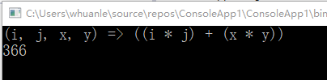

### 组装法生成表达式树

表达式由 "符号" 和 运算符组成，。

使用 **ParameterExpression** 类型 来修饰参数，使用 **Expression.Parameter(Type type,string name)** 实例化参数。

　　1，生成 a b d 参数 

```csharp
　　　　　　  ParameterExpression a = Expression.Parameter(typeof(int), "i");
            ParameterExpression b = Expression.Parameter(typeof(int), "j");
            ParameterExpression c = Expression.Parameter(typeof(int), "x");
            ParameterExpression d = Expression.Parameter(typeof(int), "y");
```

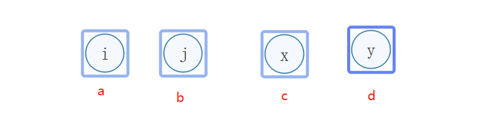

　　分析：

　　　　 **i、j、x、y** 是结点名称，**a、b、c、d** 是实例名称。不用留精力思考我上面 **a b c d i j x y** 的名称设定。

　　　　**ParameterExpression** 表示创建一个节点，**Parameter** 表示一个命名的参数表达式，详细请参考文章后面的 **“Expression 参数分类”**。

　　　　Expression.Parameter(Type type,string name) 表示这个节点的属性。

　　2，生成结点

```csharp
            Expression r1 = Expression.Multiply(a, b);      //乘法运行
            Expression r2 = Expression.Multiply(c, d);      //乘法运行
```

 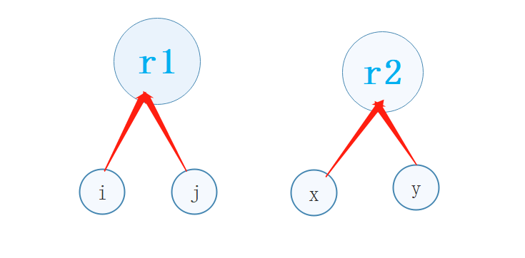

　　分析：

　　　　创建了 **( i \* j )** 和 **( x \* y )** 两个运算

　　　　**Multiply** 表示 不进行溢出检查的乘法运算。**Expression** 里有 85种 操作方法，更多加减乘除比较大小等操作在文章后面详细附上，参考 **“ 运算操作符”** 一节。

　　3，生成终结点

```csharp
Expression result = Expression.Add(r1, r2);     //相加
```

　　4，生成表达式树、转换、输出表达式树、代入数据进行运算

```csharp
            Expression<Func<int, int, int, int, int>> func = Expression.Lambda<Func<int, int, int, int, int>>(result, a, b, c, d);
            var com = func.Compile();
            Console.WriteLine("表达式" + func);
            Console.WriteLine(com(12, 12, 13, 13));
```

完整代码如下

```csharp
            ParameterExpression a = Expression.Parameter(typeof(int), "i");
            ParameterExpression b = Expression.Parameter(typeof(int), "j");

            Expression r1 = Expression.Multiply(a, b);      //乘法运行
            ParameterExpression c = Expression.Parameter(typeof(int), "x");
            ParameterExpression d = Expression.Parameter(typeof(int), "y");
            Expression r2 = Expression.Multiply(c, d);      //乘法运行

            Expression result = Expression.Add(r1, r2);     //相加
            //以上代码产生结点
            //生成表达式
            Expression<Func<int, int, int, int, int>> func = Expression.Lambda<Func<int, int, int, int, int>>(result, a, b, c, d);
            var com = func.Compile();
            Console.WriteLine("表达式" + func);
            Console.WriteLine(com(12, 12, 13, 13));
            Console.ReadKey();
```

控制台界面

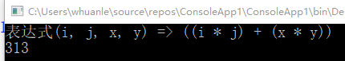


## 表达式树基础

### 1，系统自动把 Lambda表达式 转为 表达式树

　　　　对 **lambda表达式** 的要求 只能 由 传入参数 和 返回参数 两部分表示。**lambda表达式** 不能包含其它判断、循环等的代码。

　　　　　　错误举例


```csharp
            Expression<Func<int, int, int, int, int>> func = (a, b, c, d) =>
            {
                if (a < 10)
                {
                    a += 1;
                }
                /*
                 * 其它操作代码
                 */
                return a + b + c + d;
            };
```

View Code

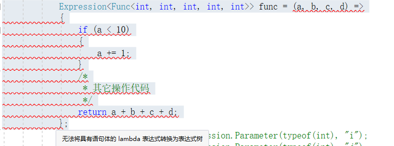

　　　　　　把那些东西通通删除，修改后：

```csharp
 Expression<Func<int, int, int, int, int>> func = (a, b, c, d) => a + b + c + d;
```

　　这样的 “最简” 的 lambda表达式 才能被系统自动转为表达式树

### 2，运算操作符

　　　　　一般数学上，有加减乘除、取余、求幂等操作，而在程序中，运算操作符可以有更多的选择，达 **85** 种。

 　　　　笔者这里给出一张图列出部分方法。

微软官方 的操作运算符列表 https://docs.microsoft.com/zh-cn/dotnet/api/system.linq.expressions.expression?view=netframework-4.7.2

估计大家看微软的文档会有点不爽~这里推荐大神翻译、整理的列表 https://blog.csdn.net/zhuqinfeng/article/details/70168337

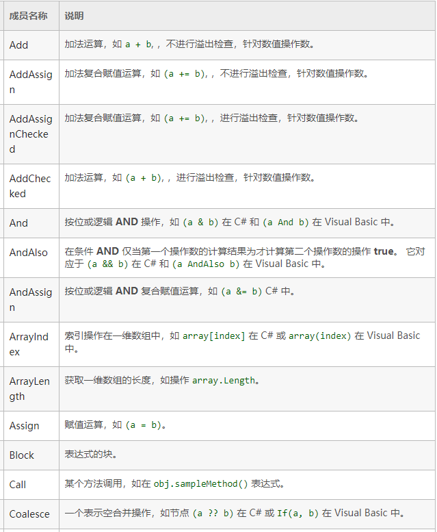

### 3，Expression 参数

以数学 椭圆周长公式：**L = 2πb + 4(a-b)** ，a 为长半轴，b 为短半轴， 进行举例 

**Parameter** 类似于 数学的 未知数 如 a 、 b；使用方法 

```csharp
ParameterExpression a = Expression.Parameter(typeof(int), "a")
ParameterExpression b = Expression.Parameter(typeof(int), "b")
```

Constant 表示一个常数，例如 2πb 中的 2 或者 2π ；使用方法

```csharp
ConstantExpression define = Expression.Constant(2);
```

　　其它更多参数分类 请查看 https://blog.csdn.net/zhuqinfeng/article/details/70168337

这里附上部分截取图片

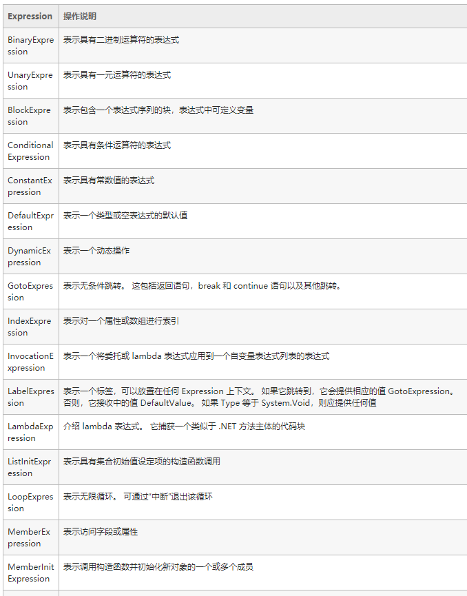

### 4，Expression 的操作方法

表示加减乘除等运算的方法。以下图举例

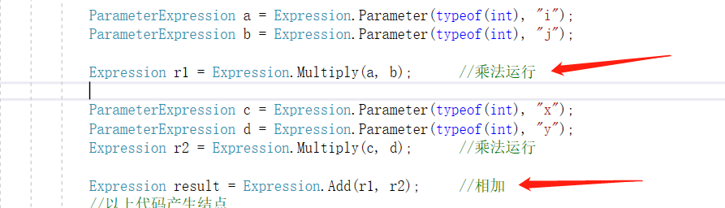

**Multiply(a,b)** 为乘法，**Add(r1,r2)** 为加法。

当然，并没有这么简单，他们都有相关的重载方法和高级的使用用途。

请查看 https://blog.csdn.net/zhuqinfeng/article/details/70168337

这里给出部分截图

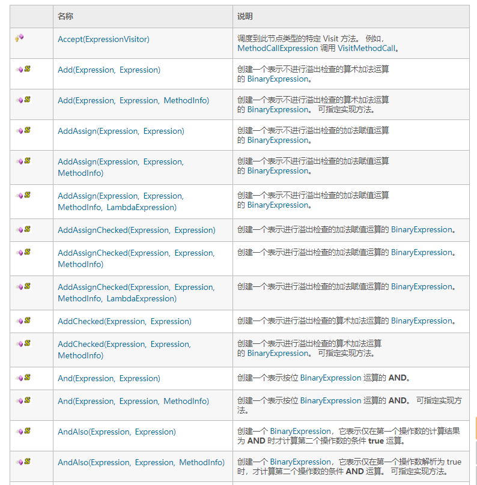

###  5，表达式树的高级用法

表达式树可以结合 数据库查询 或 **Linq**，衍生很多高级操作。

例如 动态查询、遍历表达式树、转成成 **SQL where** 子句等等，限于幅度，笔者不再赘述。

下面的链接可以查看 **System.Linq.Expressions** 的所有类型对象。https://docs.microsoft.com/zh-cn/dotnet/api/System.Linq.Expressions?view=netframework-4.7.2