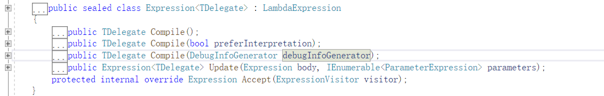
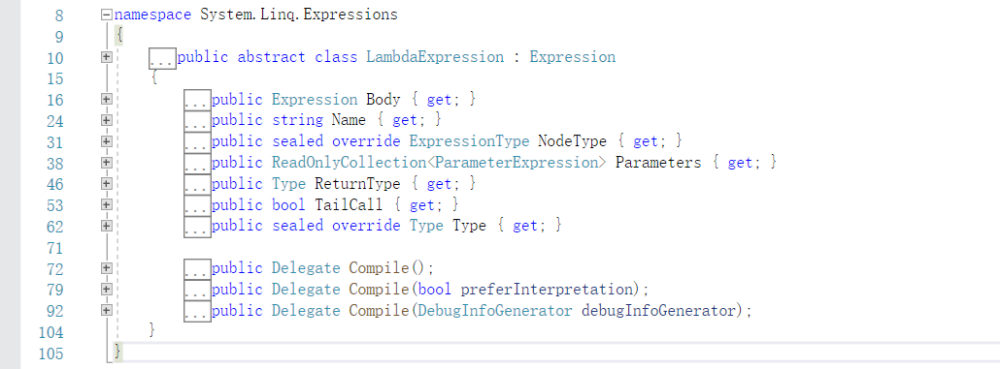

# 2. 入门基础

[TOC]


### 什么是表达式树

**来自微软官方文档的定义：**

表达式树以树形数据结构表示代码。

**它能干什么呢？**

你可以对表达式树中的代码进行编辑和运算。 这样能够动态修改可执行代码、在不同数据库中执行 LINQ 查询以及创建动态查询。 

**好不好玩？**

表达式树还能用于动态语言运行时 (DLR) 以提供动态语言和 .NET Framework 之间的互操作性，同时保证编译器编写员能够发射表达式树而非 Microsoft 中间语言 (MSIL)。 

**哪里有应用？**

ORM框架、工作流框架等，使用到 Lambda 的代码。。。动态执行代码、动态组装代码等。


## 创建表达式树

创建表达式树有两种方式：通过 lambda 表达式、通过 API。

创建表达式树的意思是，在此之前已经编写好每个结点，最后使用代码将所有结点组合起来，生成表达式树。

示例(通过API创建表达式树)

~~~c#
```
            ParameterExpression a = Expression.Parameter(typeof(int), "i");
            ParameterExpression b = Expression.Parameter(typeof(int), "j");

            Expression r1 = Expression.Multiply(a, b);      //乘法运行
            ParameterExpression c = Expression.Parameter(typeof(int), "x");
            ParameterExpression d = Expression.Parameter(typeof(int), "y");
            Expression r2 = Expression.Multiply(c, d);      //乘法运行

            Expression result = Expression.Add(r1, r2);     //相加
            //以上代码产生结点
            //生成表达式
            Expression<Func<int, int, int, int, int>> func = Expression.Lambda<Func<int, int, int, int, int>>(result, a, b, c, d);
            var com = func.Compile();
            Console.WriteLine("表达式" + func);
            Console.WriteLine(com(12, 12, 13, 13));
            Console.ReadKey();
~~~

上面关于表达式树的代码很多，以下这一步叫生成/创建表达式树。

```c#
            Expression<Func<int, int, int, int, int>> func = Expression.Lambda<Func<int, int, int, int, int>>(result, a, b, c, d);
```

以下这句叫执行表达式树

```c#
            var com = func.Compile();
```

其它代码是用于生成表达式树结点/逻辑。

回归正题，创建表达式树的两种方法。

### lambda 创建表达式树

上面的表达式树示例，是用于生成

```c#
 ( i * j ) + ( x * y ) 
```

但是就这么简单的操作，要写这么长，实在不合理。

而通过 lambda ，可以这样写

```c#
           Expression<Func<int, int, int, int, int>> func = (i, j, x, y) => (i * j) + (x * y);
```

如果使用 lambda 生成表达式树， lambda 只能使用**单行语句，不能使用 if、for等语句。**

具体关于 Lambda 的表达式树，后面其它文章有说明。


### 通过 API 创建表达式树

就是这样

```c#
Expression<Func<int, int, int, int, int>> func = Expression.Lambda<Func<int, int, int, int, int>>(result, a, b, c, d);
```

两种方式左边的都是一样的，区别在于等号右边。


## Expression< TDelegate >

上面示例的最终结果都是生成

```c#
Expression<Func<int, int, int, int, int>> func 
```

func 是表达式树变量。

我们可以了解以下表达式树具有的方法和属性。

用于生成表达式树结点的，是 Expression 类型。

那么，创建的表达式树 func ，是 `Expression<TDelegate> `类型。

定义如下

```c#
public sealed class Expression<TDelegate> : LambdaExpression
```

具有方法如下



| 方法                                                 | 说明                                                         |
| ---------------------------------------------------- | ------------------------------------------------------------ |
| Compile()                                            | 将表达式树描述的 lambda 表达式编译为可执行代码，并生成表示 lambda 表达式的委托。 |
| Compile(Boolean)                                     | 将表达式树描述的 Lambda 表达式编译为已解释或已编译的代码，并生成表示该 Lambda 表达式的委托。 |
| Compile(DebugInfoGenerator)                          | 将 lambda 编译到方法定义中。 (Inherited from LambdaExpression) |
| Update(Expression, IEnumerable<ParameterExpression>) | 创建一个与此表达式类似的新表达式，但使用所提供的子级。 如果所有子级都相同，则将返回此表达式。 |
| Accept(ExpressionVisitor)                            | 调度到此节点类型的特定 Visit 方法。 例如，MethodCallExpression调用 VisitMethodCall。 |

由于 `Expression<TDelegate>` 继承了 `LambdaExpression`，所以有很多属性方法也可以用。



| Body       | 获取 lambda 表达式的主体。                                   |
| ---------- | ------------------------------------------------------------ |
| CanReduce  | 指示可将节点简化为更简单的节点。 如果返回 true，则可以调用 Reduce() 以生成简化形式。 |
| Name       | 获取 lambda 表达式的名称。                                   |
| NodeType   | 返回此 Expression 的节点类型。                               |
| Parameters | 获取 lambda 表达式的参数。                                   |
| ReturnType | 获取 lambda 表达式的返回类型。                               |
| TailCall   | 获取一个值，该值指示是否将通过尾调用优化来编译 lambda 表达式。 |
| Type       | 获取此 Expression 表示的表达式的静态类型。                   |

好了，以上权当小笔记，备忘，目前先用不上，后面慢慢来使用。


## 解析/执行表达式树

创建表达式树后，就要执行表达式树。

在此之前，你需要了解 委托 Delegate，Func，Action，以及他们中间的关系。

执行表达式树是这样子的

```c#
            Expression<Func<int, int, int, int, int>> func = Expression.Lambda<Func<int, int, int, int, int>>(result, a, b, c, d);
            var com = func.Compile();
            var runRasult = com(12, 12, 13, 13);
```

func 只是一个表达式树，我们把表达式树构建好后，“要将表达式树转为代码”，使用

`.Compile()` 方法，可以将表达式树生成一个 委托(例如上面的 com)。

为了简洁上面使用了 var，实际上是这样的

```c#
            Func<int,int,int,int,int> com = func.Compile();
```

四个参数，一个返回值。

```c#
var runRasult = com(12, 12, 13, 13);
```

C#里有语法糖，对委托可以这样写

```c#
        Expression<Func<int, int, int, int, int>> func = Expression.Lambda<Func<int, int, int, int, int>>(result, a, b, c, d);

        int runRasult = func.Compile()(12, 12, 13, 13);
```

以后后面都是这样写了，能够缩成一行的代码，就没必要写出两行。

在 Vs 里面调试和查看表达式树，可以看这里

https://docs.microsoft.com/zh-cn/dotnet/csharp/programming-guide/concepts/expression-trees/debugging-expression-trees-in-visual-studio

初学者不必纠结于这些，了解一下本文内容，记一下概要信息即可。